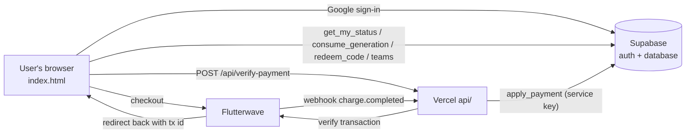

# 02 · How Imagend works

Think of Imagend like the dealership:

- **The showroom floor** (`index.html` in the browser) is where customers work. Prompts are written right there, on their device.
- **The service desk records** (Supabase) hold who the customer is, their plan and how many jobs they've used today.
- **The cashier** (Flutterwave) takes payments.
- **The back office** (`api/` on Vercel) only acts after phoning the cashier to confirm a payment is real.

## The parts

### 1. The app: `index.html`
One file with three parts:

- **Shell:** sign-in screen, Plans & team screen, Flutterwave checkout, payment confirmation and resume, and the portal tab between Image and Video.
- **Image tool** and **Video tool:** each runs inside its own frame. Their source is packed into `index.html` as base64. Editable copies are in `src/`.
  - The prompt engine runs **entirely in the browser**: idea → internal representation → one serializer per model.
  - The library, history, settings and guest usage are stored in the browser (localStorage).
  - Voice typing uses the browser's speech recognition and needs `allow="microphone"` on the frames.

The shell passes the Supabase session into each tool with `postMessage`. Tools ask the shell to open Plans (`IMAGEND_UPGRADE`), sign in (`IMAGEND_SIGNIN`) or sign out (`IMAGEND_SIGNOUT`). The shell tells tools to refresh after a payment or team change (`IMAGEND_REFRESH`).

### 2. The database: Supabase
Set up by `supabase/imagend-billing.sql`.

| Table | Holds |
|---|---|
| `plans` | Free / Creator / Studio: daily limit and prices. **Prices and limits live here.** |
| `profiles` | One row per user: `plan`, `plan_until`, `beta_until`, `team_id`, counters |
| `usage_daily` | Prompts used per user per day (Lagos date) |
| `teams` | Team name, owner, 6-character invite code |
| `payments` | One row per Flutterwave transaction (`tx_id` is unique, so it can't be credited twice) |
| `comp_accounts` | Owner emails with free unlimited access |
| `trial_claims` | One row per free trial: user, hashed network, hashed device ID, date. Deleted after 12 months |

Users can **read** their own profile and payments. They **cannot write** to anything. All changes go through these functions:

| Function | Who can call it | Does |
|---|---|---|
| `get_my_status()` | signed-in user | Returns plan, limit, used today and team |
| `consume_generation(kind)` | signed-in user | Counts one prompt, refuses if over today's limit |
| `redeem_code(code)` | signed-in user | BETATESTER → Studio until 31 Oct 2026 |
| `create_team`, `join_team`, `leave_team`, `get_team_members` | signed-in user | Teams |
| `apply_payment(...)` | **server only** (service role) | Checks the amount matches the price, records the payment, extends the plan |
| `apply_trial(user, ip_hash, device_hash)` | **server only** | Starts the 14-day Creator trial if the account, device and network pass the rules |

**How the effective plan is decided:** owner email → unlimited; otherwise the **highest** of an active paid plan, an active Creator trial and an active beta code (Studio); otherwise Free. The paid plan is stored separately, so it reappears when the beta ends. On a team, the limit is the **sum of every member's limit**, and usage is the sum of everyone's usage that day.

### 3. Payments: Flutterwave + `api/`

| File | URL | Job |
|---|---|---|
| `api/config.js` | `GET /api/config` | Gives the app the **public** key (`FLW_PUBLIC_KEY`) |
| `api/verify-payment.js` | `POST /api/verify-payment` | Called by the app with `transaction_id` or `tx_ref`. Checks the signed-in user, verifies with Flutterwave, applies the plan |
| `api/flutterwave-webhook.js` | `POST /api/flutterwave-webhook` | Flutterwave's backup notice. Checks the `verif-hash` header, verifies, applies |
| `api/claim-trial.js` | `POST /api/claim-trial` | Starts the free trial: checks the signed-in user, hashes their IP network and device ID, calls `apply_trial` |
| `api/_lib.js` | (not a URL) | Shared helpers |

**Payment reference format:** `imgnd_<plan>_<cycle>_<userId>_<timestamp>`, e.g. `imgnd_creator_monthly_<uuid>_1790000000000`. The server reads the plan, cycle and user **only from Flutterwave's verified record**, never from the browser. The database then checks that the amount matches the price.

**Three ways a payment gets confirmed (any one is enough):**
1. **Checkout callback**: card payments in the page.
2. **Redirect back**: after OPay or bank transfer, Flutterwave sends the user to `/?paid=1&transaction_id=…`.
3. **Resume on next visit**: the app remembers each payment it starts and re-checks it by reference next time the user opens Imagend.

The **webhook** covers anyone who never comes back at all.

### 4. Free trial rules

Think of it like a test drive at the dealership: one per customer. We check the customer's name (Google account), the car key they were handed (a random device ID in the browser) and the street they came from (the network's IP address).

1. One trial per account, and never for an account that has paid before.
2. Not while another plan (paid, beta or owner) is active, so a beta user can claim theirs after the beta ends.
3. One per device ID.
4. At most **2 per network in 30 days**. Several people can share one network in Lagos (an office, or a mobile carrier sharing one IP address across many phones), so a limit of 1 would block real customers.

IPs and device IDs are turned into keyed hashes on the server (HMAC-SHA256) before they are stored, so the real values are never kept.

**What it doesn't stop:** a determined person who switches to another network (mobile data, a VPN) *and* uses a fresh browser *and* a new Google account. That takes real effort for 14 days of a ₦5,000 plan, which is the point: raise the effort, don't punish shared networks.

### 5. What's new pop-up

`WHATS_NEW` in the shell lists the latest changes. It shows on each visit until the user ticks **Don't show this again**, which hides it only for that version. A new `version` makes it appear again for everyone.

## Security model and known limits

- ✅ Plans, limits and payments are decided by the database and server. Faking them in the browser doesn't work.
- ✅ Card and bank details never touch Imagend.
- ✅ Secret keys live only in Vercel environment variables. The Supabase **anon** key in `index.html` is public by design and is protected by row-level security.
- ⚠️ The prompt engine runs in the browser, so a technical user could edit the page to read prompts past the daily limit. The limit stops normal use, and paid features and payments can't be faked. Moving the engine to the server would close this, at the cost of speed and server bills.
- ⚠️ Team members can see each other's email, plan and daily usage. This is stated in the Terms and Privacy Policy.
